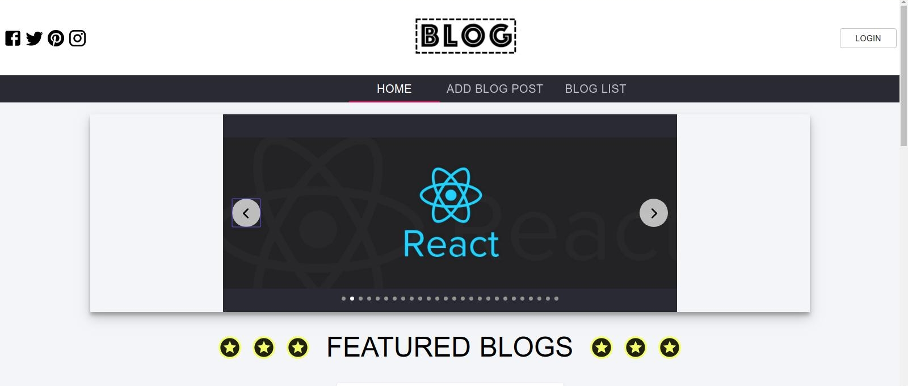

<a href="http://fvcproductions.com"></a>

# Project Title

Blogposts App - Frontend

## Table of contents

- [General Info](#general-info)
- [Technologies](#technologies)
- [Installing](#installing)
- [Licence](#license)
- [Author Info](#author-info)

## General Info

This is and app for creating blogs. App is created on two levels:

1. Backend - server side of the app

   - Go to repo: https://github.com/sanel-pajic/blogPosts-App-Graphql-NodeJs.git
   - Read README.md file for setting up the server before starting with client

2. Frontend - client side of the app
This is a training project created with one purpose: Learn more about Reactjs.

   <br/>
<div align="right">
    <b><a href="#project-title">↥ back to top</a></b>
</div>
<br/>

## Technologies

Project is created with:

- [React](https://reactjs.org/)
- [TypeScript](https://www.typescriptlang.org/)
- [Material-UI](https://material-ui.com/)
- [Apollo GraphQL](https://www.apollographql.com/)
- [Cloudinary](https://cloudinary.com/)
- [GraphQL](https://graphql.org/)

<br/>
<div align="right">
    <b><a href="#project-title">↥ back to top</a></b>
</div>
<br/>

## Installing

```
git clone https://github.com/sanel-pajic/blog-posts-app.git

```

```
cd blog-posts-app
```

```
npm install
```

```
npm start
```

<br/>
<div align="right">
    <b><a href="#project-title">↥ back to top</a></b>
</div>
<br/>

## Usage

### Create Client code

Once you create your client, hook it up to your app by passing it to the ApolloProvider exported from react-apollo.

```javascript
import React from "react";
import { render } from "react-dom";
import ApolloClient from "apollo-boost";
import { ApolloProvider } from "react-apollo";

// Pass your GraphQL endpoint to uri
const client = new ApolloClient({
  uri: "http://localhost:8000/graphql",
});

const ApolloApp = (AppComponent) => (
  <ApolloProvider client={client}>
    <AppComponent />
  </ApolloProvider>
);

render(ApolloApp(App), document.getElementById("root"));
```

##### You should see app running like on the picture

<a href="http://fvcproductions.com"></a>

<br/>
<div align="right">
    <b><a href="#project-title">↥ back to top</a></b>
</div>
<br/>

## License

MIT License

Copyright (c) [2020] Sanel Pajic

Permission is hereby granted, free of charge, to any person obtaining a copy
of this software and associated documentation files (the "Software"), to deal
in the Software without restriction, including without limitation the rights
to use, copy, modify, merge, publish, distribute, sublicense, and/or sell
copies of the Software, and to permit persons to whom the Software is
furnished to do so, subject to the following conditions:

The above copyright notice and this permission notice shall be included in all
copies or substantial portions of the Software.

THE SOFTWARE IS PROVIDED "AS IS", WITHOUT WARRANTY OF ANY KIND, EXPRESS OR
IMPLIED, INCLUDING BUT NOT LIMITED TO THE WARRANTIES OF MERCHANTABILITY,
FITNESS FOR A PARTICULAR PURPOSE AND NONINFRINGEMENT. IN NO EVENT SHALL THE
AUTHORS OR COPYRIGHT HOLDERS BE LIABLE FOR ANY CLAIM, DAMAGES OR OTHER
LIABILITY, WHETHER IN AN ACTION OF CONTRACT, TORT OR OTHERWISE, ARISING FROM,
OUT OF OR IN CONNECTION WITH THE SOFTWARE OR THE USE OR OTHER DEALINGS IN THE
SOFTWARE.

<br/>
<div align="right">
    <b><a href="#project-title">↥ back to top</a></b>
</div>
<br/>

## Author Info

- LinkedIn - [@sanel-pajic](https://www.linkedin.com/in/sanel-pajic-b506b9187/)

<a href="#project-title">Back to top</a>
